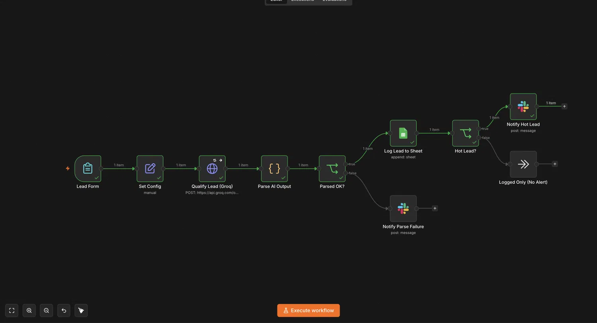
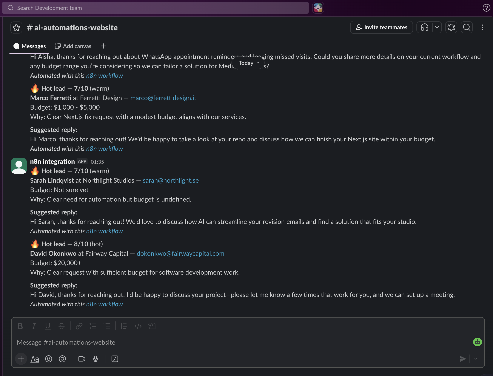
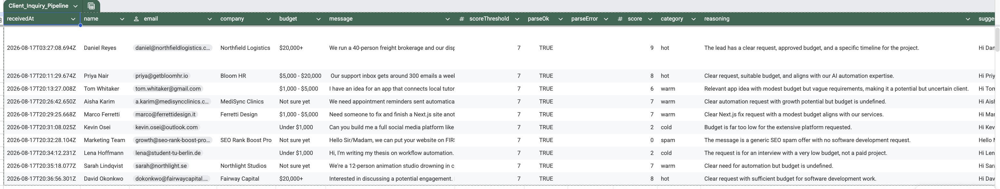

# AI Lead Triage — n8n Workflow

An inbound lead qualification pipeline built entirely in n8n. A lead submits a form, an LLM scores it 0–10 on fit and intent, the record lands in Google Sheets with the model's reasoning attached, and anything above the threshold triggers a Slack alert containing a drafted first reply.

Built as a demonstration project, not client work. The workflow runs end to end and has been tested against a fixed set of twelve cases (see [Testing](#testing)).



---

## What problem it solves

Small teams lose good leads to response latency. The inbox fills with a mix of real enquiries, tyre-kickers, students, and SEO spam, and by the time someone triages it manually the serious prospect has contacted three competitors.

This pipeline does the triage in the seconds after submission, so a human only looks at what's worth looking at — and when they do, the first reply is already drafted.

## Architecture

```
Lead Form (n8n Form Trigger)
   ↓
Set Config          — score threshold + model name in one place
   ↓
Qualify Lead        — LLM call, JSON mode, retries with backoff
   ↓
Parse AI Output     — parse + validate the model's response
   ↓
Parsed OK? ──false──→ Notify Parse Failure (Slack, with raw output)
   │true
   ↓
Log Lead to Sheet   — append record + score + reasoning
   ↓
Hot Lead? ──false──→ Logged Only (no alert)
   │true
   ↓
Notify Hot Lead     — Slack alert with drafted reply
```

Nine nodes. No custom backend, no frontend code — the form, the logic, and the integrations are all n8n.

## Design decisions

The parts that took thought, and why they are the way they are.

**Model output is validated, not trusted.**
The LLM is asked for strict JSON, but the workflow assumes it will sometimes fail to deliver. The parse step strips markdown fences, parses, and then checks that `score` is a number in range and `category` is present. Anything that fails routes to a dedicated error branch. A pipeline that assumes well-formed model output works fine in a demo and drops leads in production.

**Parse failures are surfaced, not swallowed.**
The failure branch posts to Slack with the raw model output attached. The alternative — logging an error somewhere nobody reads — means a lead disappears silently. Silent data loss is the failure mode clients have usually been burned by before.

**Replies are drafted, not sent.**
The model writes a suggested first reply and Slack shows it for one-click sending. Auto-sending AI-written replies to real prospects is a decision the business should make deliberately, not a default baked into the automation.

**Model name and threshold live in a config node.**
Both sit in `Set Config` rather than being hardcoded downstream. This turned out to matter during the build: the originally specified model was deprecated from the provider's catalog mid-development and the fix was one field, with no change to the workflow logic. Provider catalogs churn faster than most integrations assume.

**The LLM call retries and continues on failure.**
Three attempts with backoff, and a failed call routes to the error branch rather than halting the run.

**Provider-agnostic by construction.**
The qualification step is a plain HTTP request to an OpenAI-compatible endpoint. Swapping between Groq, OpenAI, or a locally hosted model is a credential and base-URL change, not a rebuild.

## Setup

**Requirements:** an n8n instance (Cloud or self-hosted), an API key for any OpenAI-compatible LLM provider, a Google account, and a Slack workspace.

1. **Import** `workflow.json` into n8n — canvas menu → Import from File.

2. **LLM credential.** The HTTP Request node uses Header Auth:
   - Name: `Authorization`
   - Value: `Bearer YOUR_API_KEY`

   The URL is set to Groq's OpenAI-compatible endpoint (`https://api.groq.com/openai/v1/chat/completions`). Point it elsewhere for a different provider.

3. **Model.** Set the `model` field in `Set Config` to a model available on your account. Confirm it supports JSON mode:

   ```bash
   curl https://api.groq.com/openai/v1/models \
     -H "Authorization: Bearer YOUR_API_KEY"
   ```

4. **Google Sheets.** Connect the credential and select your document and tab. The node auto-maps, so the sheet needs a header row:

   ```
   receivedAt | name | email | company | budget | message |
   scoreThreshold | parseOk | parseError | score | category |
   reasoning | suggestedReply | rawModelOutput
   ```

5. **Slack.** Connect the credential and pick a channel in both Slack nodes.

6. **Threshold.** `scoreThreshold` in `Set Config` controls which leads trigger an alert. Default is 8.

## Testing

Twelve fixed cases in [`test-leads.md`](test-leads.md), spanning clear buyers, ambiguous enquiries, low-value requests, and spam. Each has an expected human judgement to compare against.

The point of the set isn't to confirm the workflow runs — it's to check whether the scoring is defensible, and specifically whether the model's *ordering* of leads matches a human's.

**What the first run found.** The model over-weighted stated budget. A near-empty enquiry — "Interested in discussing a potential engagement. Please send your availability." — scored 8/10 and hot purely because the budget field said $20,000+, while a detailed description of a real problem with no stated budget scored 7. Worst-information lead ranked above best-described lead.

The model's own reasoning gave it away: it described the empty enquiry as a "clear request" when no request had been made.

**The fix was in the prompt, not the threshold.** The threshold only moves where the cutoff sits; the prompt determines the ordering, and the ordering was what was wrong. Added constraints:

- Score primarily on how specific and actionable the described need is; stated budget is a secondary signal
- Cap at 5 when no concrete problem or project is described, regardless of budget
- Academic, research, and interview requests are cold regardless of how well written
- Equity, revenue share, or exposure in place of payment caps the score at 3
- Category must follow the score band, so labels and routing stay consistent

**A second inconsistency** surfaced in the same run: with the threshold at 7 and the model banding 6–7 as warm, alerts labelled "Hot lead" were firing on leads the model had called warm. Fixed by banding the categories explicitly in the prompt and raising the threshold to 8, so the label and the routing agree.

## Screenshots

| | |
|---|---|
|  |  |

## Possible extensions

- `json_schema` response format instead of `json_object`, to guarantee output shape rather than request it
- Write to a real CRM (HubSpot, Pipedrive) in place of Sheets
- Deduplicate repeat enquiries from the same email
- A public form page posting to the webhook, for a live demo link

## Notes

Personal demonstration project. No client data is included — all test leads are fabricated, and all resource IDs have been stripped from the exported workflow.